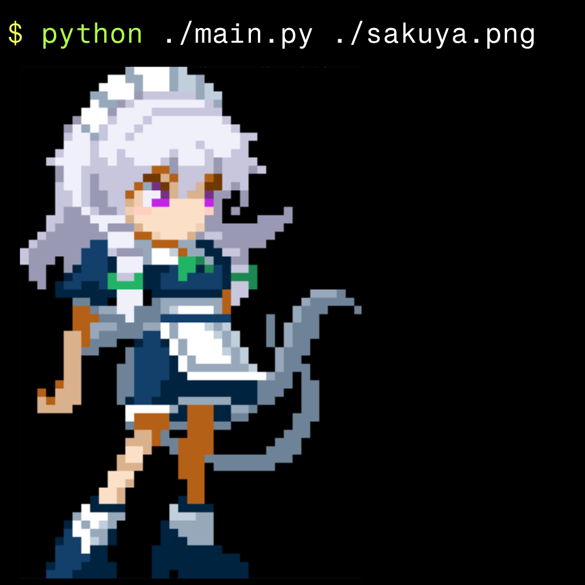

# Shell Show

An image viewer which shows selected images inside your terminal. But why? Well ... just like we used to use `neofetch` to make our terminal start up in an awesome way, I wanted to my terminal to start by showing an image. Pretty fun way to flex, you know. 

But anyways, this script works well with small resolution images. That is because I wanted to show off some pixel art in there. 

Also use `.png` images for sharp quality.

## Dependencies

The script uses only one dependency, and that is [Pillow](https://pypi.org/project/pillow/). The version I used for this app is `11.0.0`.

## Usage

```sh
python3 main.py /path/to/image  
```

## Preview


